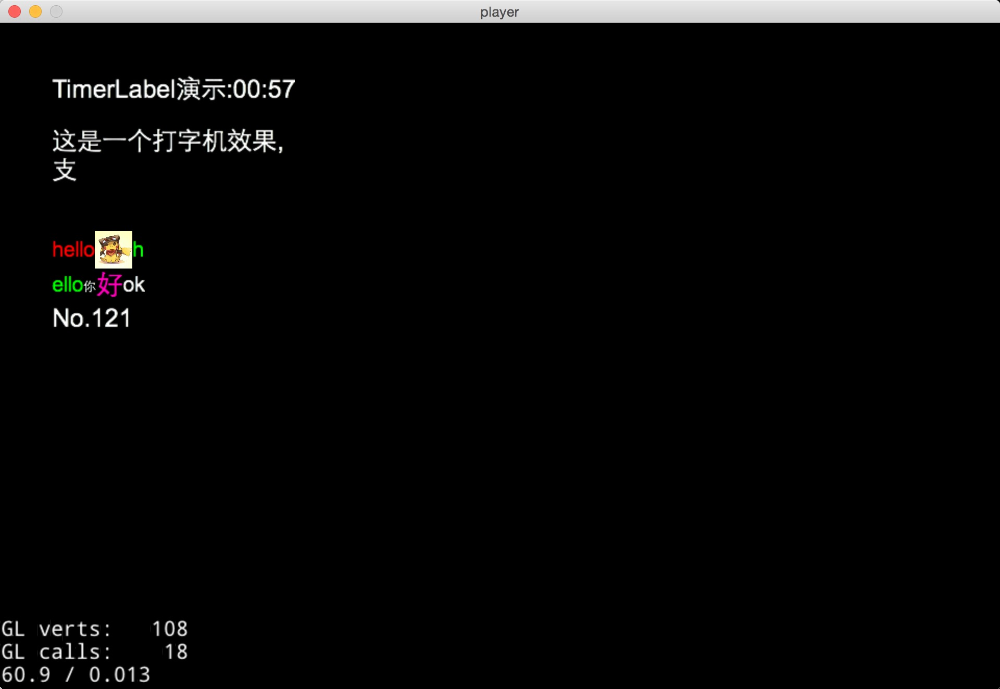

#quick-x-component
这个仓库提交了一些平时开发过程中用到的实用组件或工具类

##TimerLabel
    local timerLabel = TimerLabel.new({
        time = 60000,
        format = "TimerLabel演示:@M:@S"
    })

    timerLabel:addEventListener(TimerLabel.ON_COUNT_DOWN,function(event)
        print("倒计时结束")
    end)

    timerLabel:align(display.LEFT_TOP,50,display.height - 50):addTo(self)
除了text外,display.newTTFLabel里的所有参数都有效  
新增了time参数(单位毫秒),format参数(支持H M S),triggerTime参数(触发事件,不传时为0)  
倒计时结束会触发TimerLabel.ON_COUNT_DOWN

##TypingLabel
	local typingLabel = TypingLabel.new({
        text = "这是一个打字机效果,\n支持中英数组合,\n数字123456英文abcdefg"
    })
    
    typingLabel:addEventListener(TypingLabel.ON_FINISH_TYPING,function(event)
        print("打字机结束")
    end)
    
    typingLabel:align(display.LEFT_TOP,50,display.height - 100):addTo(self)
参数和display.newTTFLabel一样  
当点击改文字区块时,会一下显示完所有的文字  
显示完文字后悔触发TypingLabel.ON_FINISH_TYPING

##RichLabel
    local label = RichLabel.new({
        text = "
hello

hello

你

好
ok",
        size = 20,
        color = cc.c3b(255, 255, 255),
        maxWidth=90,
        lineSpace=0,
        charSpace=0,
    })
    label:align(display.LEFT_TOP,50,display.height - 200)
    label:playAnimation()
    self:addChild(label)
这个参考了[RichLabel](https://github.com/Luweimy/RichLabel)  
我只是把他揉在一个文件里并引入quick,只是方便使用罢了,没做什么贡献

##效果图
